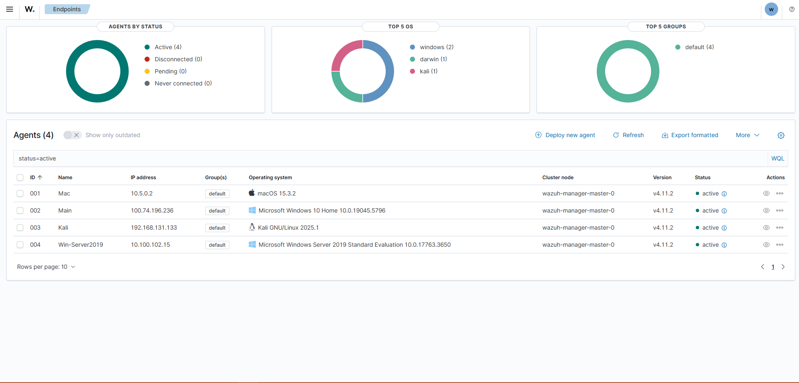
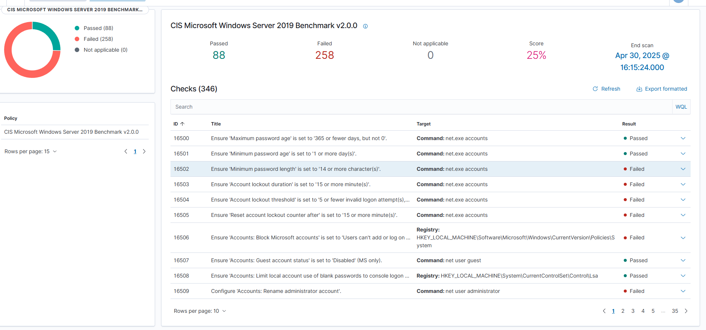

Wazuh SIEM Home Lab

"Sometimes science is more art than science, Morty." – Rick Sanchez

Overview:  
This project is a home-based SIEM lab using Wazuh, deployed in a cloud-based environment.

It’s built to simulate real-world cyber attacks, generate actual logs, and monitor endpoints with multiple operating systems, all connected to a centralized Wazuh server for alerting and log correlation.

Systems Monitored:
- Windows 10 Home (Attacker target)
- Kali Linux (Attacker box)
- macOS 15.3.2 (Normal user endpoint)
- Windows Server 2019 AD (Domain Controller)

Simulated Attack Scenarios:
- Port Scanning: Detected using Nmap from Kali to Windows 10
- Brute Force: SSH/SMB login attempts (Hydra + Fail2Ban logs)
- Privilege Escalation: Windows event logs for admin privilege abuse
- Web Exploitation: LFI/XSS via Apache and PHP test app
- Log Tampering: Simulated by manual modification of log files

Misconfigurations Identified:  
Wazuh was also used to scan for common misconfigurations via the CIS benchmark for Windows Server 2019.

- 258 failed checks
- Weak password policies
- Guest account enabled
- Missing account lockout thresholds
- Unrestricted local admin access

(See screenshots below)

What I Learned:
- How to centralize log data from multi-OS environments
- Writing and tuning custom Wazuh rules and decoders
- Investigating real alerts and correlating logs
- Using Wazuh’s CIS checks to identify system weaknesses

Tools Used:
- Wazuh Manager & Agent
- Filebeat
- Elasticsearch & Kibana
- Nmap, Hydra, Burp Suite
- VMware Workstation / VirtualBox

Goal:  
The purpose of this lab is to:
- Practice log-based detection
- Understand attacker behavior and indicators
- Strengthen real-world incident response skills
- Simulate a basic SOC workflow with cloud components

Screenshots:

Wazuh Dashboard with Active Endpoints:  

Windows Server 2019 Threat Assessment (CIS Benchmark):  

Sample Log File (Simulated Alerts):  
[View wazuh_detailed_simulated_log.log](logs/wazuh_detailed_simulated_log.log)

---

Project built with sweat, logs, packet captures, and a bit of interdimensional sarcasm.
